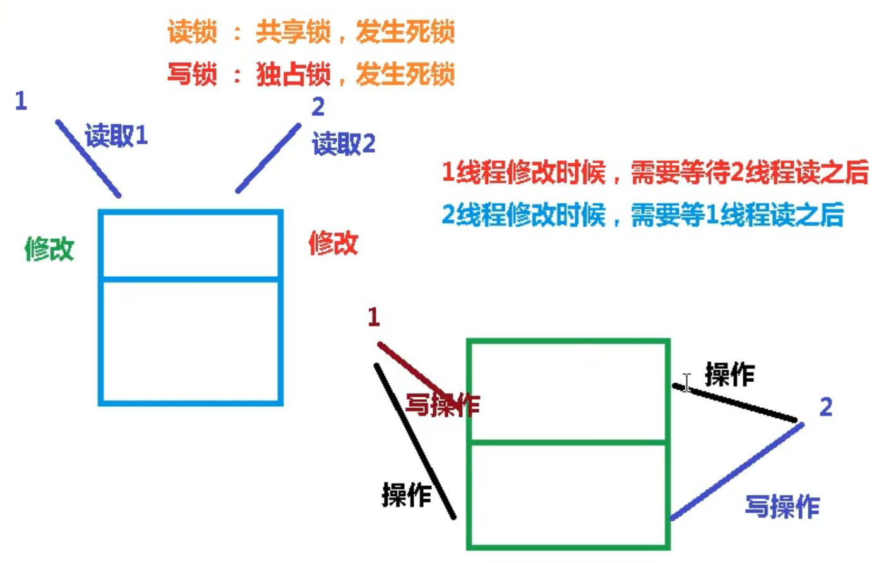
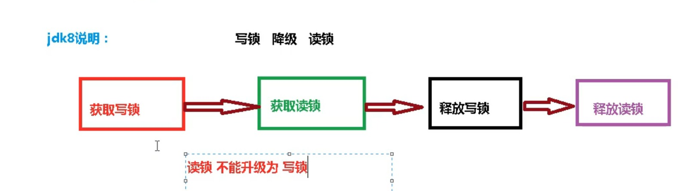
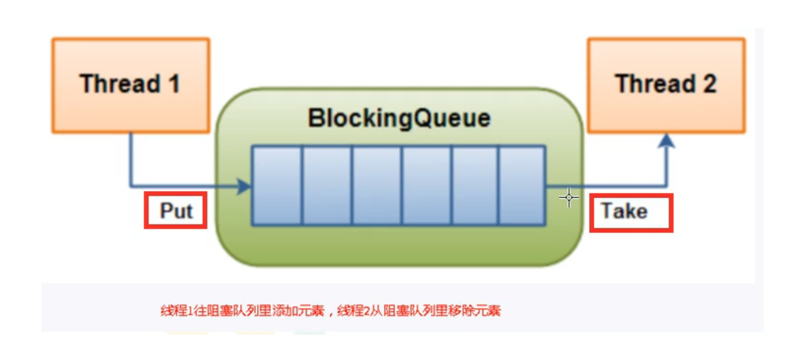
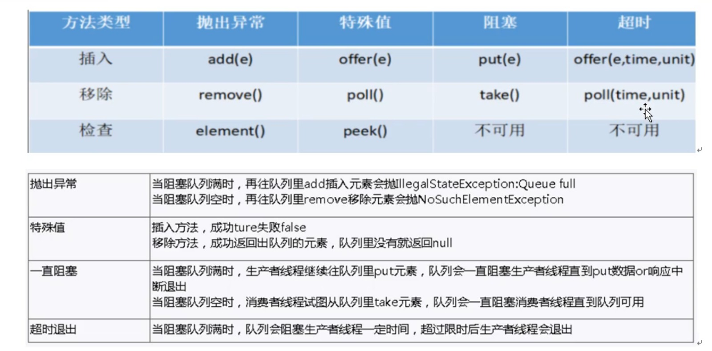

# Java.util.concurrent-Practice

Practicing Notes for Java.util.concurrent Practice

## Process

A process, in the simplest terms, is an executing program.
## Thead

One or more threads run in the context of the process. A thread is the basic unit to which the operating system allocates processor time. A thread can execute any part of the process code, including parts currently being executed by another thread.
4 Ways to create thread
1. Thread
2. Runnable
3. Callable
4. ThreadPool

## Lifecycle and States of a Thread in Java


1. New Thread: When a new thread is created, it is in the new state. The thread has not yet started to run when the thread is in this state. When a thread lies in the new state, its code is yet to be run and hasn’t started to execute.
2. Runnable State(准备就绪): A thread that is ready to run is moved to a runnable state. In this state, a thread might actually be running or it might be ready to run at any instant of time. It is the responsibility of the thread scheduler to give the thread, time to run. 
A multi-threaded program allocates a fixed amount of time to each individual thread. Each and every thread runs for a short while and then pauses and relinquishes the CPU to another thread so that other threads can get a chance to run. When this happens, all such threads that are ready to run, waiting for the CPU and the currently running thread lie in a runnable state.
3. Blocked(阻塞)/Waiting state(不见不散): When a thread is temporarily inactive, then it’s in one of the following states: 
    * Blocked
    * Waiting
4. Timed Waiting(过时不候): A thread lies in a timed waiting state when it calls a method with a time-out parameter. A thread lies in this state until the timeout is completed or until a notification is received. For example, when a thread calls sleep or a conditional wait, it is moved to a timed waiting state.
5. Terminated State: A thread terminates because of either of the following reasons: 
    * Because it exits normally. This happens when the code of the thread has been entirely executed by the program.
    * Because there occurred some unusual erroneous event, like segmentation fault or an unhandled exception.

## Wait vs Sleep

| sleep | wait |
| --- | ----------- |
| static method for Thread Class | method under Obejct class |
| Lock is not applied | Lock is applied when called |
| interrupted() applied | Lock is applied when called |

## 并发性(concurrency) vs 并行(parallelism)
### Concurrency


Concurrency relates to an application that is processing more than one task at the same time. Concurrency is creates the illusion of parallelism, however actually the chunks of a task aren’t parallelly processed, but inside the application, there are more than one task is being processed at a time. 
**Concurrency is achieved through the interleaving operation of processes on the central processing unit(CPU) or in other words by the context switching**.

### Parallelism


**Parallelism is related to an application where tasks are divided into smaller sub-tasks that are processed seemingly simultaneously**. It is used to increase the throughput and computational speed of the system by using multiple processors. It enables single sequential CPUs to do lot of things “seemingly” simultaneously. **Parallelism leads to overlapping of central processing units and input-output tasks in one process with the central processing unit and input-output tasks of another process**. Whereas in concurrency the speed is increased by overlapping the input-output activities of one process with CPU process of another process.

### Monitor
A synchronization mechanism to make sure that only one thread can access protected data/code.

### User Thread vs Daemon Thread
* User Thread
    When main thread end, JVM is still alive as long as user thread is running.
* Daemon Thread
    When main thread end, JVM will end as long as no user thread running even Daemon is running.(ie. Garbage collection)

### Lock vs Synchronized
1. Lock is a Interface and synchronized is a keyword in Java.
2. Deadlock
    * When there is an exception in synchronized, it will **unlock** for the current thread and therefore **dead-lock will not happen**.
    * When there is an exception in Lock, if we did not call unlock(), dead-lock is likely to happen. Therefore, we need to call unlock() in finally block.
3. Lock can interrupt/terminate the wating thread and synchronized can not be interrupt/terminate when waiting.
4. **Lock**  know if it acquire the lock while synchronized not.
5. Lock is more efficient.

**Lock is used to make sure the order and accessability for the reasource that is possiblely access by multiple threads.**

### Communication between Threads
#### Working examples for the communications between 2 working threads
```java
// Shared Resource
class Share {
    private int number = 0;
    public synchronized void incre() throws InterruptedException {
        if (number != 0) {
            this.wait();
        }
        number++;
        System.out.println(Thread.currentThread().getName() + "::" + number);
        this.notifyAll();
    }
    public synchronized void decr() throws InterruptedException {
        if (number == 0) {
            this.wait();
        }
        number--;
        System.out.println(Thread.currentThread().getName() + "::" + number);
        this.notifyAll();
    }
}

//Working Threads
public class ThreadDemo1 {
    public static void main(String[] args) {
        Share share = new Share();
        new Thread(() -> {
            for (int i = 0; i < 10; i++) {
                try {
                    share.incre();
                } catch (InterruptedException e) {
                   e.printStackTrace();
                }
            }
        }, "AA").start();

        new Thread(() -> {
            for (int i = 0; i < 10; i++) {
                try {
                    share.decr();
                } catch (InterruptedException e) {
                    e.printStackTrace();
                }
            }
        }, "BB").start();
    }
}
```
[**spurious wakeup**](https://en.wikipedia.org/wiki/Spurious_wakeup) problems will happend when there are more than 2 working threads trying to access the sharead resources.
Normally , we change the if to **while** to solve the problem.
```java
synchronized (obj) {
    while (<condition does not hold>)
        obj.wait();
    ... // Perform action appropriate to condition
}
```
#### Notify() vs notifyAll()
In the case of the multiThreading, notify() method sends the notification to only one thread among the multiple waiting threads which are waiting for the send lock. While notifyAll() methods in the same context send notifications to all waiting threads instead of a single thread.

### Customized Communication between Threads
```java
//Shared Resource
class ShareResource{
// define flag for communication between threads
// 1 -> AA; 2 -> BB; 3 -> CC corresponding to Threads.
private int flag = 1;
private Lock lock = new ReentrantLock();

//The Condition class provides the ability for a thread to wait for some condition to occur while executing the critical section.
private Condition c1 = lock.newCondition();
private Condition c2 = lock.newCondition();
private Condition c3 = lock.newCondition();

public void print5(int loop) throws InterruptedException {
    lock.lock();
    try {
        while (flag != 1) {
            c1.await();
        }
        for (int i = 0; i < 5; i++) {
            System.out.println(Thread.currentThread().getName() + " :: " + i + " Loops:" + loop);
        }
        flag = 2;
        c2.signal();
    } finally {
        lock.unlock();
    }
}
public void print10(int loop) throws InterruptedException {
    lock.lock();
    try {
        while (flag != 2) {
            c2.await();
        }
        for (int i = 0; i < 10; i++) {
            System.out.println(Thread.currentThread().getName() + " :: " + i + " Loops: " + loop);
        }
        flag = 3;
        c3.signal();
    } finally {
        lock.unlock();
    }
}

public void print15(int loop) throws InterruptedException {
    lock.lock();
    try {
        while (flag != 3) {
            c3.await();
        }

        for (int i = 0; i < 15; i++) {
            System.out.println(Thread.currentThread().getName() + " :: " + i + " Loops: " + loop);
        }
        flag = 1;
        c1.signal();
    } finally {
        lock.unlock();
    }
}
}
//Working Thread
public class ThreadDemo {
public static void main(String[] args) {
    ShareResource shareResource = new ShareResource();
    new Thread(() -> {
        for (int i = 0; i < 10; i++) {
            try {
                shareResource.print5(i);
            } catch (InterruptedException e) {
                throw new RuntimeException(e);
            }
        }
    }, "AA").start();
    new Thread(() -> {
        for (int i = 0; i < 10; i++) {
            try {
                shareResource.print10(i);
            } catch (InterruptedException e) {
                throw new RuntimeException(e);
            }
        }
    }, "BB").start();
    new Thread(() -> {
        for (int i = 0; i < 10; i++) {
            try {
                shareResource.print15(i);
            } catch (InterruptedException e) {
                throw new RuntimeException(e);
            }
        }
    }, "CC").start();
}
}
```
### Java Collections Examples
1. List is not Thread safe.

    ```java
    //source code for List add() method
    private void add(E e, Object[] elementData, int s) {
        if (s == elementData.length)
            elementData = grow();
        elementData[s] = e;
        size = s + 1;
    }
    // will thrown the error 
    final void checkForComodification() {
        if (modCount != expectedModCount)
        throw new ConcurrentModificationException();
    }
    ```

    To use Data structrues as following.

    * Vector
    ```java
    //source code for add() fro Vector and synchronized is declared
    List<String> list = new Vector<>();
    public synchronized boolean add(E e) {
        modCount++;
        add(e, elementData, elementCount);
        return true;
    }
    ```
    * Collections.synchronizedList
    ```java
    List<String> list = Collections.synchronizedList(new ArrayList<>());
    ```
    * CopyOnWriteArrayList<>()
    ```java
    public boolean add(E e) {
        synchronized (lock) {
            Object[] es = getArray();
            int len = es.length;
            es = Arrays.copyOf(es, len + 1);
            es[len] = e;
            setArray(es);
            return true;
        }
    }
    ```
    concurrent read and independent write to **replace/combine** the prev data.
2. HashMap/HashSet is not Thread safe.
    * For HashSet
    ```java
    Set<String> set = new CopyOnWriteArraySet<>();
    ```
    * For HashMap
    ```java
    Map<String, String> map = new ConcurrentHashMap<>();
    ```

### Levels of Synchronized Lock
1. Synchronized declared at normal method level, lock **this** object.
2. Static Synchronized declared at method level, lock current **class**.
3. Synchronized block, lock the **object within the block**.

### Fair Lock vs Unfair Lock
* UnFair Lock
    ```java
    // Create NonfairLock for default
    public ReentrantLock() { sync = new NonfairSync();}
    // we can pass a parameter in constructor to configure fair/unfair lock
    public ReentrantLock(boolean fair) { 
        sync = fair ? new FairSync() : new NonfairSync();
    }
    ```
    **High Efficieny**, it may happen that workload **not evenly distributed**.

* Fair Lock
```java
static final class FairSync extends Sync {
    private static final long serialVersionUID = -3000897897090466540L;
    /**
     * Fair version of tryAcquire.  Don't grant access unless
     * recursive call or no waiters or is first.
     */
    @ReservedStackAccess
    protected final boolean tryAcquire(int acquires) {
        final Thread current = Thread.currentThread();
        int c = getState();
        if (c == 0) {
//会检查是否存在predecessor在前面排队，如果没人，才会进行下一步
//Check whether predecessor threads are in queue.
//Only proceed when there is no.
            if (!hasQueuedPredecessors() &&
                compareAndSetState(0, acquires)) {
                setExclusiveOwnerThread(current);
                return true;
            }
        }
        else if (current == getExclusiveOwnerThread()) {
            int nextc = c + acquires;
            if (nextc < 0)
                throw new Error("Maximum lock count exceeded");
            setState(nextc);
            return true;
        }
        return false;
    }
}
```

### Recursive Lock
Both Synchronized（implicit）and Lock（explicit）are **Recursive Lock**.
* Synchronized
    ```java
    //prove that we can recursively call add(..) coz the StackOverflow thrown
    public synchronized void add(){
        add(); // 会出现StackOverflow, 证明可以重复调用add(…)
    }
    //Lock
    new Thread(() -> {
        synchronized (o) {
            System.out.println(Thread.currentThread().getName() + " out-most layer");
            synchronized (o) {
                System.out.println(Thread.currentThread().getName() + " middle layer");
                synchronized (o) {
                    System.out.println(Thread.currentThread().getName() + " inner-most layer");
                }
            }
        }
    }, "AA").start();
    //Output: out-mid-inner -> we can recursively lock.
    ```
* ReentrantLock
```java
Lock lock = new ReentrantLock();
new Thread(() -> {
    try {
        lock.lock();
        System.out.println(Thread.currentThread().getName() + " tut-most layer");
        try {
            lock.lock();
            System.out.println(Thread.currentThread().getName() + " middle layer");
            try {
                lock.lock();
                System.out.println(Thread.currentThread().getName() + " inner-most layer");
            } finally {
                lock.unlock();
            }
        } finally {
            lock.unlock();
        }
    } finally {
        //lock.unlock(); take note that we did not release the lock
    }
}, "t1").start();
new Thread(() -> {
    lock.lock();
    //app will be blocked here as the lock not been released yet as shown above
    System.out.println(Thread.currentThread().getName());
    lock.unlock();
}, "t2").start();
```


### Deadlock
A deadlock is a situation in which two computer programs sharing the same resource are **effectively preventing each other from accessing the resource**, resulting in both programs ceasing to function.
Below are the sample code for the deadlock.
```java
public class DeadlockDemo {
    static Object a = new Object();
    static Object b = new Object();
    public static void main(String[] args) {
        new Thread(() -> {
            synchronized (a) {
                System.out.println(Thread.currentThread().getName() + " acquired a, try to acquire b");
                try {
                    TimeUnit.SECONDS.sleep(1);
                } catch (InterruptedException e) {
                    throw new RuntimeException(e);
                }
                synchronized (b) {
                    System.out.println(Thread.currentThread().getName() + " acquired b");
                }
            }
        }, "A").start();

        new Thread(() -> {
            synchronized (b) {
                System.out.println(Thread.currentThread().getName() + " acquired b, try to acquire a");
                try {
                    TimeUnit.SECONDS.sleep(1);
                } catch (InterruptedException e) {
                    throw new RuntimeException(e);
                }
                synchronized (a) {
                    System.out.println(Thread.currentThread().getName() + " acquired a");
                }
            }
        }, "B").start();
    }
}
```
To Verify the existence of deadlock
1. type ```jcmd``` to get process id
2. type ```jstack <pid>``` to get result.

### Callable
The Callable interface is similar to Runnable, in that both are designed for classes whose instances are potentially executed by another thread. 
**A Callable do return a result and cannot throw a checked exception.**

| Callable | Runable |
| ------ | ----------- |
| V call() | void run() |
| return value or exeception | No Return value |
```java
class MyThread1 implements Runnable{

    @Override
    public void run() {

    }
}
class MyThread2 implements Callable{

    @Override
    public Integer call() throws Exception {
        return 200;
    }
}
public static void main(String[] args) throws ExecutionException, InterruptedException {
    new Thread(new MyThread1(), "A").start();
    //Callable error not support
    //new Thread(new MyThread2(), "B").start();

    // Runnable Interface -> FutureTask class
    // Constructor > FutureTask(Callable c)

    FutureTask<Integer> futureTask1 = new FutureTask<>(new MyThread2());
    //lambda
    FutureTask<Integer> futureTask2 = new FutureTask<>(() -> {
        System.out.println(Thread.currentThread().getName());
        
        return 1024;
    });
    new Thread(futureTask1, "B").start();
    new Thread(futureTask2, "C").start();

//        while (!futureTask1.isDone()) {
//            System.out.println("wait...");
//        }
    System.out.println(futureTask1.get());
    System.out.println(futureTask2.get());
    //it will directly raeturn res as only get executed once.
    System.out.println(futureTask2.get());
    System.out.println("Main over");

}
```
### CountDownLatch

A CountDownLatch is initialized with a **given count(defined in constructor)**. 
The **await()** methods block **until the current count reaches zero** due to invocations of the **countDown()** method, after which all waiting threads are released and any subsequent invocations of await return immediately. This is a one-shot phenomenon -- the count cannot be reset.
```java
//set initial value for the count
CountDownLatch countDownLatch = new CountDownLatch(6);
        for (int i = 0; i < 6; i++) {
            new Thread(() -> {
                System.out.println(Thread.currentThread().getName() + " left classroom");
                //count - 1
                countDownLatch.countDown();
            }, String.valueOf(i)).start();
        }
        //wait until count deducted to 0
        countDownLatch.await();
        System.out.println(Thread.currentThread().getName() + " lock the classroom");
```
### CyclicBarrier

The count ofCountDownLatch cannot be reset. If you need a version that **resets the count**, consider using a **CyclicBarrier**.
A synchronization aid that allows a set of threads to all wait for each other to **reach a common barrier point**. CyclicBarriers are useful in programs involving a fixed sized party of threads that must occasionally wait for each other.
```java
public class DEMO {
    public static final int NUMBER = 7;
    public static void main(String[] args) {
        CyclicBarrier cyclicBarrier = new CyclicBarrier(NUMBER, () -> {
            System.out.println("finally got all 7 dragon balls");
        });
        //define the process of gathering balls
        for (int i = 0; i < 7; i++) {
            new Thread(() -> {
                System.out.println(Thread.currentThread().getName() + " dragon ball collected");
                try {
                    //wait until nos of thread who invoked await() reached the barrier
                    //cyclicBarrier += 1
                    //it will call the runnable (2nd param) once it reaches the barrier
                    cyclicBarrier.await();
                } catch (Exception e) {
                    e.printStackTrace();
                }
            }, String.valueOf(i)).start();
        }
    }
}
```
### Semaphore

A counting semaphore. Conceptually, a semaphore **maintains a set of permits**. Each acquire() blocks if necessary until a permit is available, and then takes it. Each release() adds a permit, potentially releasing a blocking acquirer. 
Semaphores are often used to **restrict the number of threads than can access some (physical or logical) resource**.
```java
//6 cars park 3 slots
public class DEMO {
    public static void main(String[] args) {
        // 3 permits/slots
        Semaphore semaphore = new Semaphore(3);
        // 6 thread/cars
        for (int i = 0; i < 6; i++) {
            new Thread(() -> {
                try {
                    // get slot/permit, block until one is available
                    semaphore.acquire();
                    System.out.println(Thread.currentThread().getName() + " get the slot/permit");
                    TimeUnit.SECONDS.sleep(new Random().nextInt(5));
                    System.out.println(Thread.currentThread().getName() + " release the slot/permit");
                } catch (InterruptedException e) {
                    throw new RuntimeException(e);
                } finally {
                    semaphore.release();
                }
            }, String.valueOf(i+1)).start();
        }
    }
}
```

### Pessimistic Lock vs Optimistic Lock

**Optimistic Locking** is a strategy where you read a record, take note of a version number and check that the version hasn't changed before you write the record back.
If the record is dirty (i.e. different version to yours) you abort the transaction and the user can re-start it.
**Pessimistic Locking** is when you lock the record for your exclusive use until you have finished with it. It has much better integrity than optimistic locking but requires you to be careful with your application design to **avoid Deadlocks**. 


### row lock and table lock
Table-level locking systems always lock entire tables. Row-level locking systems can lock entire tables if the WHERE clause of a statement cannot use an index.

### Read lock and Write lock

Read lock is shared lock while write lock is exclusive. Both of them posssibly cause deadlock as shown below.

```java
class MyCache {
    private volatile Map<String, Object> map = new HashMap<>();
    //Create ReadWrite Lock
    private ReadWriteLock rwLock = new ReentrantReadWriteLock();
    //put
    public void put(String key, Object value) {
        //lock Writelock (exclusive)
        rwLock.writeLock().lock();
        System.out.println(Thread.currentThread().getName()+ " is writing " + key);
        try {
            TimeUnit.MICROSECONDS.sleep(300);
            map.put(key, value);
            System.out.println(Thread.currentThread().getName()+ " finished writing " + key);
        } catch (InterruptedException e) {
            throw new RuntimeException(e);
        } finally {
            //release write lock
            rwLock.writeLock().unlock();
        }
    }
    //get
    public Object get(String key) {
        //lock readlock (shared)
        rwLock.readLock().lock();
        Object res = null;
        System.out.println(Thread.currentThread().getName()+ " is reading " + key);
        try {
            TimeUnit.MICROSECONDS.sleep(300);
            res = map.get(key);
            System.out.println(Thread.currentThread().getName()+ " finished reading " + key);
        } catch (InterruptedException e) {
            throw new RuntimeException(e);
        } finally {
            //release read lock
            rwLock.readLock().unlock();
        }
        return res;
    }
}
public class ReadWriteLockDemo {
    public static void main(String[] args) {
        MyCache myCache = new MyCache();
        for (int i = 0; i < 5; i++) {
            final int num = i;
            new Thread(() -> {
                myCache.put(num + "", num + "");
            }, String.valueOf(i+1)).start();
        }
        for (int i = 0; i < 5; i++) {
            final int num = i;
            new Thread(() -> {
                myCache.get(num + "");
            }, String.valueOf(i+1)).start();
        }
    }
}
```
A ReadWriteLock maintains a pair of associated locks, one for read-only operations and one for writing. The read lock may be held simultaneously by multiple reader threads, so long as there are no writers. The write lock is exclusive.


```java
    ReentrantReadWriteLock rwLock = new ReentrantReadWriteLock();
    ReentrantReadWriteLock.ReadLock readLock = rwLock.readLock();
    ReentrantReadWriteLock.WriteLock writeLock = rwLock.writeLock();
    // case 1
    // get write lock
    writeLock.lock();
    System.out.println("write-----");
    //get readlock
    readLock.lock();
    System.out.println("read----");
    //output: write---- read---
    //we can read in write
    writeLock.unlock();
    readLock.unlock();

    // case 2
    //get read lock
    readLock.lock();
    System.out.println("read----");

    //get write lock
    writeLock.lock();
    System.out.println("write----");
    // output:read----
    // we can not write during read
```

### Blocking Queue


#### methods available

```java
public class BlockingQueueDemo {
    public static void main(String[] args) throws InterruptedException {
        //DEMO 1
        //Fixed size set to 3
        BlockingQueue<String> blockingQueue = new ArrayBlockingQueue<>(3);
        System.out.println(blockingQueue.add("a")); // true
        System.out.println(blockingQueue.add("b"));
        System.out.println(blockingQueue.add("c"));
        System.out.println(blockingQueue.element()); // retrieve head follows FIFO principle

        //System.out.println(blockingQueue.add("d"));//Exception: java.lang.IllegalStateException: Queue full
        System.out.println(blockingQueue.remove());
        System.out.println(blockingQueue.remove());
        System.out.println(blockingQueue.remove());
        System.out.println(blockingQueue.remove()); //Exception: java.util.NoSuchElementException


        //DEMO 2
        System.out.println(blockingQueue.offer("a"));
        System.out.println(blockingQueue.offer("b"));
        System.out.println(blockingQueue.offer("c"));
        System.out.println(blockingQueue.offer("d")); // false
        System.out.println(blockingQueue.poll());
        System.out.println(blockingQueue.poll());
        System.out.println(blockingQueue.poll());
        System.out.println(blockingQueue.poll());//null

        //DEMO 3
        blockingQueue.put("a");
        blockingQueue.put("b");
        blockingQueue.put("c");
        blockingQueue.put("d"); // blocking state until there is space in the queue

        blockingQueue.take();
        blockingQueue.take();
        blockingQueue.take();
        blockingQueue.take(); // blocking until there is an element in the queue

        //DEMO 4
        System.out.println(blockingQueue.offer("a"));
        System.out.println(blockingQueue.offer("b"));
        System.out.println(blockingQueue.offer("c"));
        System.out.println(blockingQueue.offer("d", 3, TimeUnit.SECONDS)); // block up to 3 secs
    }
}
```